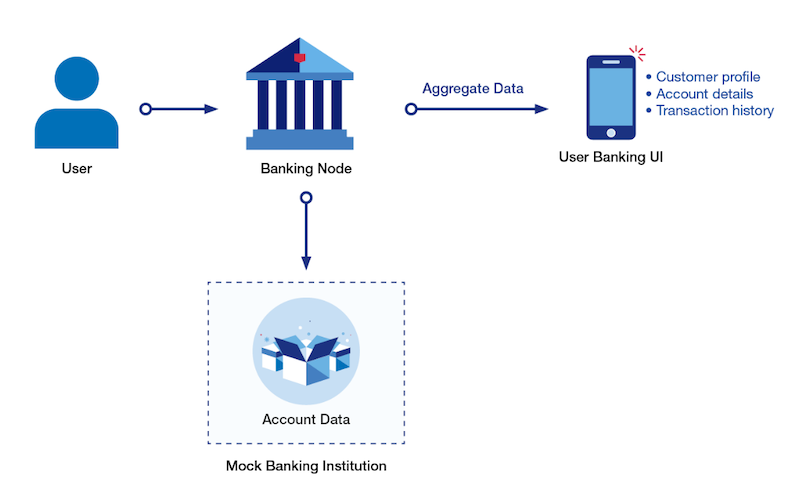

## Core Banking API

This API collection has read-only methods for interacting with the financial accounts for a given customer. It provides a variety of views into customer data including customer information, account details, transaction history and transaction details.

- [Features](#features)
- [Workflow](#workflow)
- [Use Cases](#usecases)
- [FAQs](#faq)

### Features {#features}
- Each API user is provided with their own unique set of synthetic data with a rich set of synthetic data for a mock customer including balances. transactions, and account history
- Provides a general financial picture of a particular customer including their different bank accounts & respective balances
- View current balances across a customer's entire portfolio
- Can search for a variety of transactions within a user-supplied date range.
- Customer contact information can be retrieved for personalization
- Provides extensive product details for a specific account
- Retrieve a user's transaction history and running balance for a number of U.S. Bank products
- Products include: Personal checking accounts; Savings accounts; Consumer and Business Credit cards; & Lines of Credit
- Create a new banking account for a specific customer.

### Workflow {#workflow}

### Use Cases {#usecases}
- Integrate U.S. Bank data into a personal financial management app and help customers track and manage their spending.
- Integrate U.S. Bank data into business and accounting software (e.g. Intuit, Sage) to help small businesses improve tracking and management of their business (e.g. provide cash flow analysis).

### FAQs {#faq}

#### Q. Will I have my own test accounts?
If you are creating a consumer focused application, you will receive a unique *customer ID*. Each customer record includes a savings account, checking account and two credit accounts. You can use the `/customer/{customerID}` method to find the customer details.

#### Q. Where do I find all my accounts?
You can find all the accounts associated with a specific customer record by using the `/customer/{customerID}/accounts` method. It will return an array of accounts.

#### Q. What is the field name for the account number?
The *account number* is a unique identifier and listed as the *accountID* in the account record.

There is another field, *paymentAccountID*, that corresponds to the parent account responsible for funding this account. For consumer accounts, the *paymentAccountID* will usually be the same as the *accountID*. One exception would be a companion credit card account.

#### Q. How can I find the current balance for a specific account?
The `/account/{accountID}` method provides all the details about a specific account, including its current balance.

In general, there are two different types of accounts:
 - **ASSET** - an account that has monetary value like a savings or checking account. The balance details include the opening balance, current balance and available balance.
 - **LIABILITY** - a debt account such as a credit account that has an obligation to pay. The balance details include the credit limit, available credit and current balance (amount due).

#### Q. How do I find the all the transactions for a specific account?
The `/account/{accountID}/trans/{type}` method will provide a list of transactions for the account corresponding to the given *accountID*.

This method takes a *type* parameter that allows you to retrieve only specific transactions. The allowed values are:
 - **FULL** - Detailed listing of all transactions
 - **SHORT** - Short listing of all transactions - suitable for a summary
 - **PUR** - Listing of card purchases
 - **PMT** - Listing of card payments
 - **MEMO** - Listing of non-monetary transactions (memos)

#### Q. Can I look at a specific transaction?
Yes, you can use the */transaction/{transactionID}* method to retrieve the details of a single transaction.

#### Q. Can we create our own transactions?
Yes, the [Money Movement API](./money.md) emulates a number of different financial transactions. However, transactions are generally limited to particular account types. For example, withdrawals and deposits can only be performed for **direct deposit accounts** (*e.g.* savings and checking).

#### Q. What level of details is available for a credit card transaction?
The transaction data only provides basic information such as the merchant name, transaction amount, date and the transaction category. It does not provide detailed information such as the specific items, quantities purchased, sales tax or shipping. These details, known as *Level 2/3 item details*, are typically only available from the merchant itself.

#### Q. Can I find the category for a given credit card purchase? If so, where?
Yes, it is listed in the transaction record. When the *category* field has a value of "*mcc*", then the *subcategory* field will contain the specific category code.

The [Reference API](./reference.md) documentation provides more details about the meaning of the **merchant category code** and how to use them.

#### Q. Will any of the Core Banking APIs work for the CAAS accounts?
The short answer is 'yes'. You can look up account details for any account using the `/account/{accountID}` whether it is a virtual card account or an LOC account.

On the other hand, you will not be able to use the *customer-related* methods for CAAS because those accounts are all associated with a company account, not a customer account.
