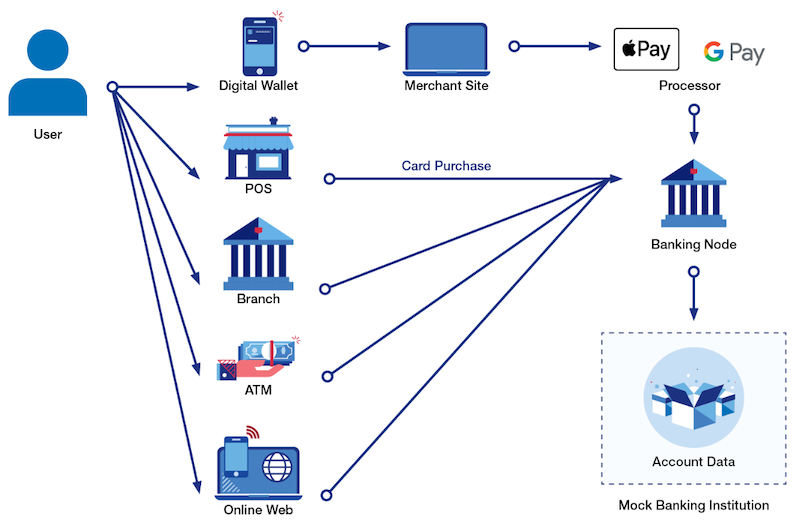

## Money Movement API

The Money Movement API suite allows one to perform a variety of financial transactions into and out of different synthetic accounts to emulate real customer behavior: paying bills, depositing checks, purchasing items, etc. In general, one will perform these transactions from the perspective of a single customer using the assigned synthetic accounts. [[API documentation](./moneySpec.md)]

- [Features](#features)
- [Workflow](#workflow)
- [Use Cases](#usecases)
- [FAQs](#faq)

### Features {#features}
- Emulate a credit card purchase at a Point of Sale
- Confirms that card information is valid and account is open; confirms that there is sufficient credit available for purchase
- Returns a purchase receipt
- Make a deposit or withdrawal from a Direct Deposit account
- Options allow one to emulated different channels (branch, online or check)
- Party information is collected
- Make a payment to a credit account (Overpayment is not allowed)
- Able to transfer money from existing DDA account
- Make a funds transfer (internal transfers will contain cross reference identifiers to reconcile payments; external transfers are allowed between different customers)
- Automatically updates the corresponding account balances to reflect the transaction
- Each financial creates a unique transaction record that becomes part of the corresponding account's history.

### Workflow {#workflow}

### Use cases {#usecases}
- Set up an auto-payment to deal with recurring bills.
- Encourage savings by making periodic deposits based on external behaviors.
- Monitor card purchases to identify opportunities to save money.
- Build a budgeting application and monitor outgoing expenses.
- Build a fraud alert feature that monitors incoming transactions for discrepancies.

### FAQs {#faq}
#### Q. Do these money movement transactions affect my account balances?
Yes, all account balances are updated to reflect every new transaction in realtime. Furthermore, the account's *lastActivityDate* field will indicate the last time any activity occurred on the account.

#### Q. How do I make a deposit?
The `/actvity/deposit` method emulates a deposit transaction for a savings or checking account. It requires both a valid *accountID* and *amount*. There are also two optional parameters that allow you to emulate different types of deposits.

 - **Deposit a check**: both the *checkNumber* and the *party* field are submitted.
 - **Electronic deposit**: the *party* field is submitted but the *checkNumber* field is empty.
 - **Cash deposit**: both the *checkNumber** and the *party* fields are empty.

#### Q. How do I make a withdrawal?
The `/actvity/withdrawal` method emulates a withdrawal transaction for a savings or checking account.It requires both a valid *accountID* and *amount*. There are also two optional parameters that allow you to emulate different types of withdrawals.

 - **Write a check**: both the *checkNumber* and the *party* field are submitted.
 - **Electronic bank transfer**: the *party* field is submitted but the *checkNumber* field is empty.
 - **Cash withdrawal**: both the *checkNumber** and the *party* fields are empty.

#### Q. How do I make a credit card purchase?
The `/activity/card-purchase` method emulates a typical credit card transaction either at a *point of sales* with a merchant or via an online commerce site. Therefore, you will need to provide the same information that you would in the real world. This includes:
 - Your 16-digit card *checkNumber*
 - name listed on the card (*firstName* and *lastName*)
 - expiration date (month and year)
 - zip code associated with the card
 - security code (*cvv*)

Additionally, you will need to provide the details about the purchase:
  - amount - the purchase amount
  - merchant - the name of the merchant or business
  - mcc - the merchant category code used for classifying the purchase
  - *inPerson* (optional) - '*false*' if the purchase was online

#### Q. Where do I find my credit card details?
You can find the card details for any credit account by using the `/account/{accountID}/cards` method in the *Core Banking API*.

Additionally, you can find the card details for a virtual card by using the `/vcards/{cardID}/details` method in the *CAAS API*.

#### Q. How do I make a card purchase using a digital wallet?
Digital wallet purchases can be performed using the `/activity/digital-wallet` method.

Before you can make a card purchase using a digital wallet, you will need to package the card for a digital wallet (there are methods for doing this in the *CAAS API*). This method generates an *encryptedCardData* string.

You will use the *encryptedCardData* string along with the *walletID* that you defined to package the card. You will also need to include the *amount*, *merchant* and *mcc* value, as are required for any card purchase.

#### Q. Can I transfer money between test accounts?
Yes, you can transfer money between accounts according to certain business rules. **Direct deposit accounts**, such as checking and savings accounts, can be used to initiate a funds transfer. Credit card accounts, however, cannot be used to transfer money from.

Each funds transfer creates two related transaction records: one for the funding account showing the funds leaving it; and another transaction for the source account showing the funds coming it. The corresponding transaction identifiers are listed as the *transactionID* and *referenceTransactionID* so that you can do the reconciliation.

All funds transfers require that the funding account has sufficient money available.

When you transfer money to a credit card account, you are in fact making a credit card payment.

#### Q. What is the *reverse-card* method?
The `/activity/card-reverse` method emulates a dispute of a credit charge. It requires the *transactionID* of the original credit card purchase. When successful, it will reverse the original charge and credit the account with amount of the original purchase.

The resulting transaction will include the number of the original *transactionID* in the *referenceTransactionID* field.

#### Q. Why can't I reverse a credit card charge for a virtual card?
Virtual card purchases cannot be reversed for logistical reasons. In this simulated environment, the transactions are being created in real time from the perspective of the consumer (or cardholder). In a real scenario, a representative from the company would likely dispute a charge to one of its virtual cards. This scenario is not supported in this ecosystem.

#### Q. What is the difference between making a card payment and an internal funds transfer?
The `/activity/payment` method is used to make a card payment to a credit account using an external funding source (such as mailing in a physical check).

You can also make a card payment by using the */activity/funds-transfer* method which will simply transfer money from one of your test savings or checking accounts to your target credit card account. This emulates making an online payment.

#### Q. Why can't I make a payment for a virtual card?
The card payment method in the *Money Movement API* only works for credit accounts that have perpetual credit - in other words, those accounts that can be continuously repaid. A virtual card is preloaded with a specific balance which cannot be exceeded. For virtual cards, you must use the the payoff method in the *CAAS API*.
