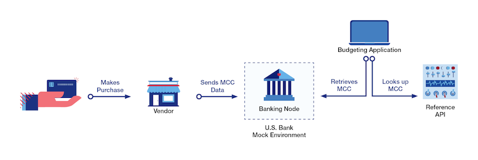

## Reference API 

This API provides methods to look up both the definitions of  U.S. Bank common product definitions and industry standard Merchant Category Codes.

### Features
- Provides complete details of Merchant Category Codes (MCC).
- Ability to look up MCC definition by code.
- Ability to find all related MCC values by searching with a key word (e.g. "Restaurant").
- Retrieve the complete list of all MCC value.
- Provides a list of U.S. Bank products.
- Contains common product abbreviations.

### Use Cases
- Classify customer purchases (using MCC codes) for budgeting purposes.
- Propose opportunities for customers to save money.
- Create card controls to restrict user purchases for only approved categories (based on MCC).
- Create fraud alerts by analyzing transaction history to find abnormal spending behaviors.

> **Note:** A *Merchant Category Code* (MCC) is a four-digit code assigned to every business that applies to accept credit cards. This code indicates the nature of the merchant's business (*e.g.*, Airlines, Veterinary Sciences, Hardware Store, etc.) They have become the standard for categorizing card purchases based on industry.

### FAQs
#### Q. How do I look up a specific MCC code?
The `/code/{mcc}` method will return the description for a specific merchant code.

This method is very useful for categorizing a specific purchase.

#### Q. What if I don't know the MCC code? How can I find the appropriate MCC code?

The *Reference* API also has a search function for you to look up MCC codes based on their description. Specifically, the `/codes/search/desc={search_string}` method allows you to query for a given string. For example, you can search for all the MCC codes associated with a general industry, such as "Food" or "Legal"
