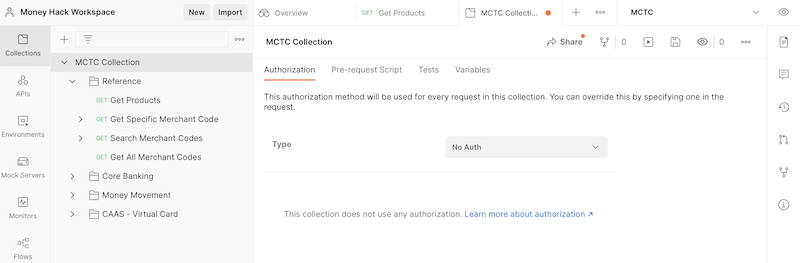
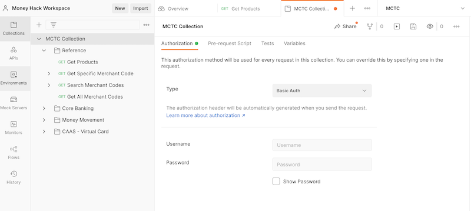
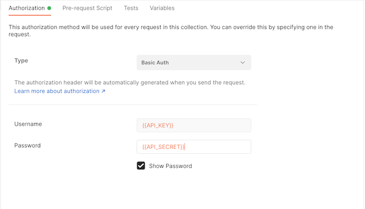
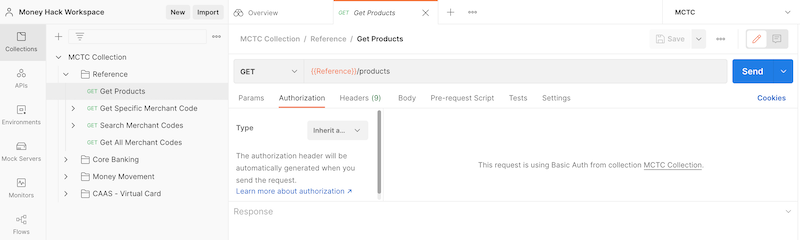

### U.S. Bank Innovation Developer Portal

#### API Security
There are three principle ways to implement security for APIs:
- Basic Auth (user ID, password)
- API Keys (unique generated values)
- OAuth (secondary system verifies user, provides token)

The U.S. Bank hackathon APIs use Basic Auth security method. However, the credentials are the keys that are provided by the developer portal when you create a project. (This process is described [here](../portal/getAPIKey.md)).

This information is included in the header of your API request.
- Username = *Your Unique API Key*
- Password = *Your Unique API Secret*

#### Setting up Basic Auth in Postman
The easiest way to set up *authorization* in Postman is to define the security for your entire collection. Then each folder and method will inherit from its parent and the same authorization configuration will apply for every API method call.

**Step 1:** Select the root level folder of your collection.

In this example, it will be the *MCTC Collection* folder.

Initially, this page will select the *Authorization* tab and show the current authorization method. By default, it will be set to *No Auth*.

**Step 2:** Select *Basic Auth* from the options in *Type* dropdown menu.

This will open up a form where you can put in your credentials that were obtained from the U.S. Bank Innovation developer portal.

>Note: The basic authorization method will automatically construct the correctly formatted authorization header for your API calls.

**Step 3:** Enter your credentials for Basic Auth.

Set the **username** to your *API Key* and the **password** to your *API Secret*. Instead of setting the specific value directly here, the preferred method is to set your credentials in your workspace's environment.

If you imported the *MCTC environment* file, you will see that there are already two variables defined for this use: *API_KEY* and *API_SECRET*. You will simply need to replace their values with your own unique credentials.

If you do this, then you will simply need to reference these values in this security form.

>Note: Environment variables are indicated by wrapping them with double curly parentheses.

**Step 4:** Make sure that your methods are inheriting authorization.

- Select a method from your Collection
- Click on the *Authorization* tab
- Make sure that the authorization type is set to *Inherit auth from parent*
- You should also see a confirmation message (*e.g.*, "This request is using Basic Auth from collection MCTC Collection"). 

#### References for using Basic Auth:
- [Basic Auth in node.js](https://dzone.com/articles/nodejs-call-https-basic) - How to call an API with Basic Auth
- [Tutorial on implementing Basic Auth](https://jasonwatmore.com/post/2018/09/24/nodejs-basic-authentication-tutorial-with-example-api) - How to build your own API that implements Basic Auth
