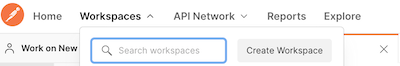
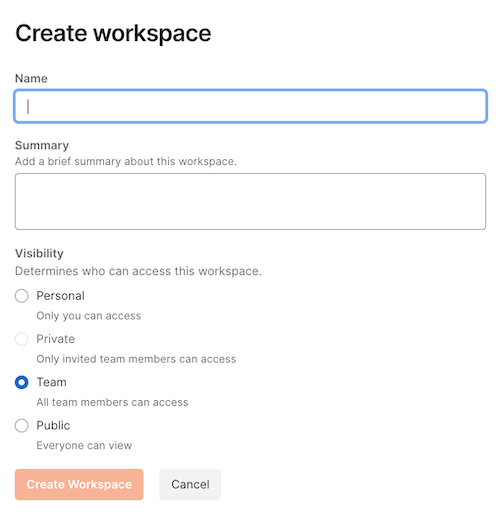
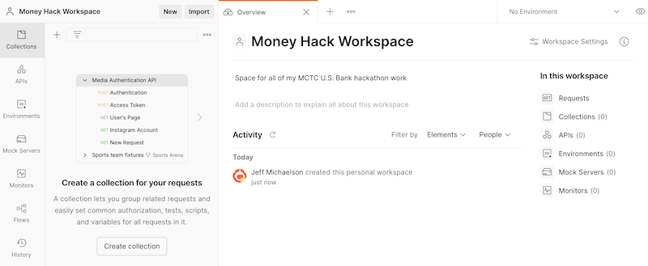

### U.S. Bank Innovation Developer Portal

## Using Postman

Postman is one of the best tools to work with APIs. It is a complete platform that can be used to build, test and use APIs.

You can either [download Postman](https://www.postman.com/downloads/) to your computer or work with the [online version](https://www.postman.com/). This is a personal preference. Both options allow you to share files and collaborate with others.

Postman uses a couple of key concepts to organize your work: *collections*, *environments* and *workspaces*.

> A **collection** is an executable API description. In other words, it is a machine-readable JSON definition format for defining, organizing, and working with the definitions of individual APIs, helping make APIs more discoverable and accessible throughout the lifecycle of each individual API.

> An **environment** consists of a set of key-value pairs that represent the context and conditions in which a request is sent.

> A **workspace** gives users a consolidated view of all the Postman elements they commonly use: collections, environments, and more. They can be used to organize collections and environments, allowing API definitions to be grouped into more meaningful and logical groupings.

The [Postman Blog](https://blog.postman.com/how-to-organize-your-api-definitions/) provides more information about how to organize your work on Postman.

### Importing files
We have provided a Postman collection and environment so that you can explore and test all of the U.S. Bank Innovations APIs.

You can download them from our GitHub site:
- [Postman collection for hackathon](https://github.com/interrogen/hackathon/tree/master/Technical-Resources)

#### Creating a Workspace
If you don't already have a *workspace* defined in Postman, you will need to create one.

**Step 1:** Select the *Workspaces* menu option in the main menubar and then click the *Create Workspace* option.

 **Step 2:** Complete the following dialog with your preferences. You will probably not want to set the *Visibility* to *Public*.

 

In this example, I created a new workspace called 'Money Hack Workspace'. Below is the new *empty* workspace.

Select the *Workspaces* menu option in the main menubar and then click the *Create Workspace* option.

>Note: you will need to update the global parameters with your specific data such as API Key, Secret Key

How to use?

>Screenshot
