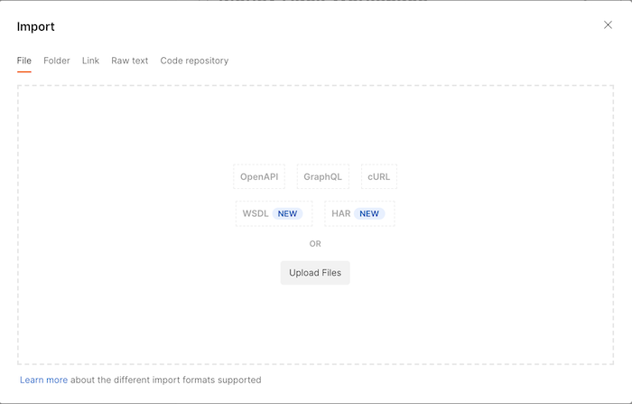

### U.S. Bank Innovation Developer Portal

## Using Postman
- [Creating a workspace](#create)
- [Importing files into Postman](#import)
- [Update the environment](#update)
- [Using the Postman collection](#using)

Postman is one of the best tools to work with APIs. It is a complete platform that can be used to build, test and use APIs.

You can either [download Postman](https://www.postman.com/downloads/) to your computer or work with the [online version](https://www.postman.com/). This is a personal preference. Both options allow you to share files and collaborate with others.

Postman uses a couple of key concepts to organize your work: *collections*, *environments* and *workspaces*.

> A **collection** is an executable API description. In other words, it is a machine-readable JSON definition format for defining, organizing, and working with the definitions of individual APIs, helping make APIs more discoverable and accessible throughout the lifecycle of each individual API.

> An **environment** consists of a set of key-value pairs that represent the context and conditions in which a request is sent.

> A **workspace** gives users a consolidated view of all the Postman elements they commonly use: collections, environments, and more. They can be used to organize collections and environments, allowing API definitions to be grouped into more meaningful and logical groupings.

The [Postman Blog](https://blog.postman.com/how-to-organize-your-api-definitions/) provides more information about how to organize your work on Postman.

We have another page that covers setting up [API security](./security), including setting up security in Postman.

### Postman files
We have provided a Postman collection and environment so that you can explore and test all of the U.S. Bank Innovations APIs.

You can download them from our GitHub site:
- [Postman collection for hackathon](https://github.com/interrogen/hackathon/tree/master/Technical-Resources)

>Note: Store these files on your hard drive so that you can import them into Postman according to the directions below.

#### Creating a Workspace {#create}
If you don't already have a *workspace* defined in Postman, you will need to create one.

**Step 1:** Select the *Workspaces* menu option in the main menubar and then click the *Create Workspace* option.

 **Step 2:** Complete the following dialog with your preferences. You will probably not want to set the *Visibility* to *Public*.

 

In this example, I created a new workspace called 'Money Hack Workspace'. Below is the new *empty* workspace.

#### Importing files into Postman {#import}
**Step 1:** Click the *Import* button located to the right of your *Workspace* name. This will bring up a dialog where you can load the Postman collection and Postman environment files (from above)

**Step 2:** Click on the *Upload Files** button and select the files that you downloaded from GitHub. (In this case, *MCTC Collection* and *MCTC* environment files).

**Step 3:** Click *Import* to bring the files into your workspace.

The main Postman screen shows the number of different assets in this newly created workspace: it indicates that you now have one collection and one environment. You can also see that the *MCTC Collection* is listed among your collections.

#### Update the Environment {#update}

While the environment has been imported, it has not yet been selected. This is indicated in the upper right where it says *No Environment*.

**Step 1:** In order to use the newly imported environment, select it from the dropdown menu at the upper right.

When you select *MCTC*, it will now be the active environment. You can view the current environment settings by clicking on the *eye* icon.

The next thing that you will need to do is to add your personal data information to the environment file.

>Note: You will get your *API Key* and *API Secret* through the developer portal (see [How to get your API Key](../portal/getApiKey.md)).  Your individual *customer ID* will be distributed via email prior to the event.

**Step 2:** Click the *Edit* button to add your data.

**Step 3:** Update the **Inital Value** entries for the *API_Key*, *API_SECRET* and *CUST_ID* with your values.

**Step 4:** Once you have updated the initial values, click the *Reset All* button in the upper right. This will copy the value from the **INITIAL VALUE** column into the **CURRENT VALUE** column.

**Step 5:** Click *Save* to update your environment values.

#### Using the Postman collection {#using}
Now that you have successfully updated the environment file, you should be able to test the methods in the Postman collection.

**Step 1:** Expand the collection in the left hand navigation window to reveal the different methods. Each method is listed by its verb followed by the name.

>Note: You can use nested folders within a given collection. The *MCTC Collection* contains separate folders for each API.

**Step 2:** Select a specific to work with it. For example, click on the *Get Products* method.

This is one of the simplest methods as it doesn't require any parameters. Other methods may require some input data (inline parameters, arguments or data passed in the body).

**Step 3:** Press the *Send* button to invoke the method.

The response message is returned in the *Body* section. In this case, it is presented as a JSON object (as indicated by the drop down above the message).

> Note: The HTTP status code is also given.

As you work more with Postman, you will leverage many of its other capabilities, including the HTTP headers, test cases and examples.

You can learn even more about Postman at the [Postman Learning Center](https://learning.postman.com/docs/getting-started/introduction/)
