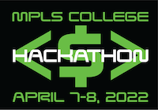

# The Money Hack Hackathon

## Minneapolis College, April 7-8, 2022

The Minneapolis College Hackathon gives you real-life experience using our APIs. At this event, you'll solve business problems with new mobile app solutions through hands-on learning activities intended to support the understanding and use of APIs in app development.

- [Event schedule](./MCTCSpring2022Schedule.md) 
- [Frequently Asked Questions](./FAQ.md)

### Challenges and prizes
#### Challenges
How can U.S. Bank help you and college students feel more secure about your finances, be better prepared to weather unexpected expenses, and be a helpful partner through life’s moments – big or small.

With that in mind, how might you create a solution to help students be successful in managing their money?

For example, how might you:

- Create a budgeting tool? What would you like it to do?
- Develop a tool that rewards for good financial behavior?
- Provide tools and resources around debt management?

#### Judging criteria
- **Simplicity** (5 points): Is the application simple to use and can the team explain it clearly in three sentences or less?
- **Creativity** (5 points): How creative was the team in developing an innovative solution for the challenge?
- **Impact** (5 points): Did the team create an application that can have a real and valuable impact?
- **Design** (5 points): Was the UX/UI intuitive and appealing?

#### Prizes
Each student of the winning teams (maximum 5 students per team) will receive:

- **First Place**: $500 VISA gift card
- **Second place**: $250 VISA gift card
- **Third Place**: $100 VISA gift card
- **Audience Choice award**: Attend the event to find out the prize.

Plus, get some cool SWAG including our collector’s edition Hackathon t-shirt, notebooks and door prizes.
