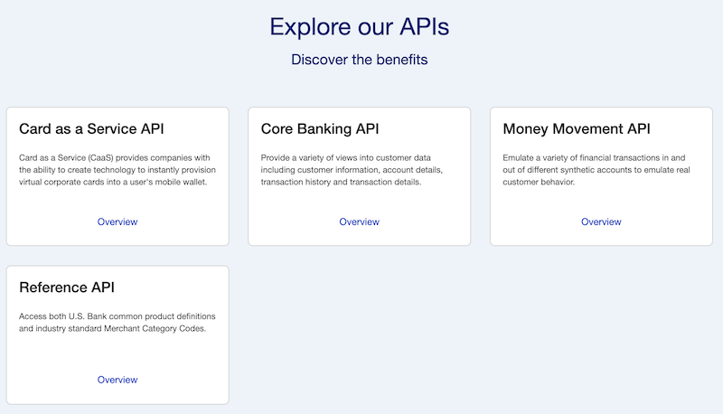
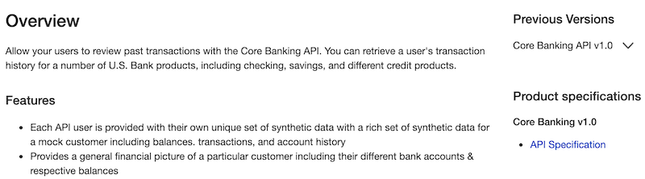
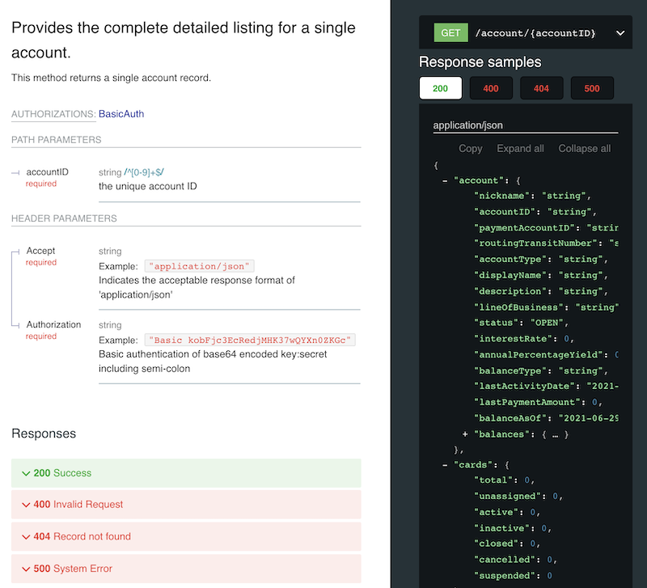
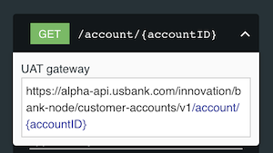

### U.S. Bank Innovation Developer Portal

## Exploring the APIs
**Step 1:** From the main portal page, scroll down to the area with the API tiles.

**Step 2:** You will see a brief description of each API. For more details, click the *Overview* link within the API tile. Below is a snippet from the page for the *Core Banking API*.

This will provide an overview of each API including its main features and possible use cases.

**Step 3:** The detailed API specification are available in the right hand column listed under Product Specifications. Select the *API Specification*.

>Note: You must be logged in to see the API specification.

These specifications are written in well-formatted YAML documents. Below is a portion of the specifications for the *Core Banking API*, namely the `GET /account/{accountID}` method.

In the picture above, you can see an element of an API specification: `GET /account/{accountid}` (specifically, the structure of a successful response message (status = 200).

The API specification will show the request and response messages for all of the available methods for an API.

**Step 4:** You can also view the specific URL to the API by clicking the arrow in the API specification.

The base URL is *alpha-api.usbank.com/innovation/bank-node/customer-accounts/v1* while the method is */account/{accountID}*. The HTTP action is **GET**.
