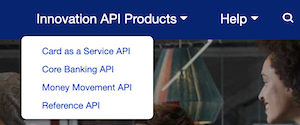
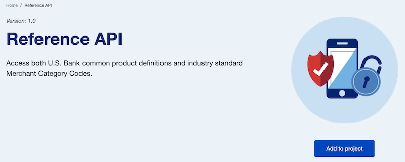
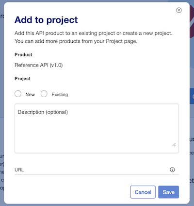
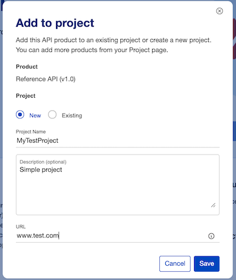
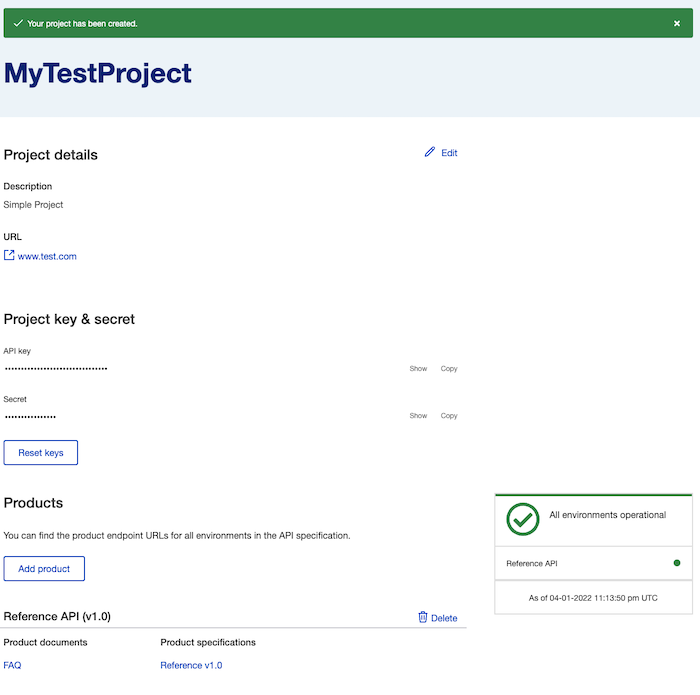
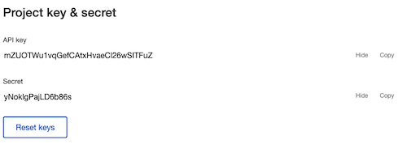
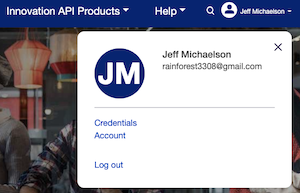
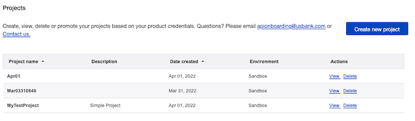

### U.S. Bank Innovation Developer Portal

### Using the APIs - API Keys
In order utilize the APIs that are exposed through the developer portal, you will need to obtain an **API key**. This is a unique key code generated for you and will be used to authentication when calling a secure API.

The process for obtaining a key involves the creation of a project on the portal (which will generate an API key). Then, you link your project to other APIs which basically provisions them to your account.

- [Creating a project]{#creating}
- [Viewing your API credentials]{#viewing}
- [Adding more APIs to a project Project]{#adding}

#### Creating a project {#creating}

The process for creating a project is done through the API products which are accessible from the title bar.

**Step 1:** Select one of the APIs from the drop down menu for the *Innovation API Products*. In this case, we will choose the *Reference API*.

**Step 2:** Click the *Add to project* button which will open up a modal dialog box.

**Step 3:** Complete the new project form. You will also need to provide a URL (though it is not actually used at this time).

Then press the *Save* button.

This will bring you to a new page where you can see the details about the project that you just created.

#### Viewing your API credentials {#viewing}
The values for your API credentials are initially obfuscated but you can see them by clicking the *Show* link (in the above screen).

>Note: Use the *Copy* link in order to copy your exact credentials - and avoid accidentally missing a character or two.

**Alternative method:** If you want to view your existing projects and credentials later, go to the main menu and click on the triangle next to your user name.

Select *Credentials*.

This will bring you to a list of all of your current projects.

Select *View* next to the project that you want to see.

>Note: You can also create a new project from this screen. You will be required to select one API product to associate with your project. Otherwise, the process is identical to the one described above.

#### Adding more API products to your project {#adding}
In general, you will want to add all of the APIs to your project so that you can use them within your application. There are two ways to do this.

**Method 1:**

In order to do this, you will need to go to each API product page and add it manually. You can easily get to each API product by selecting the Product menu on the home page.

**Method 2:**

>Image

**Step 1:** Select the API product to go to its specific page.
