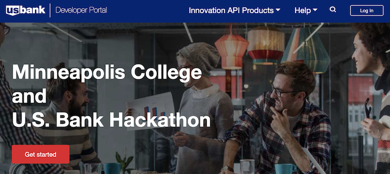
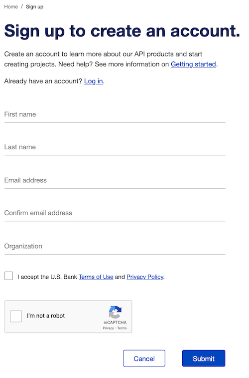
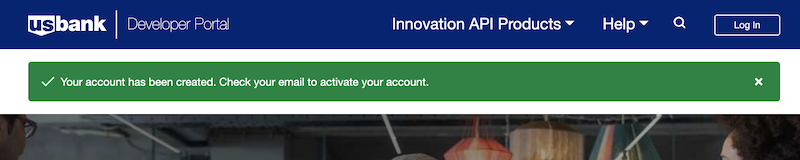
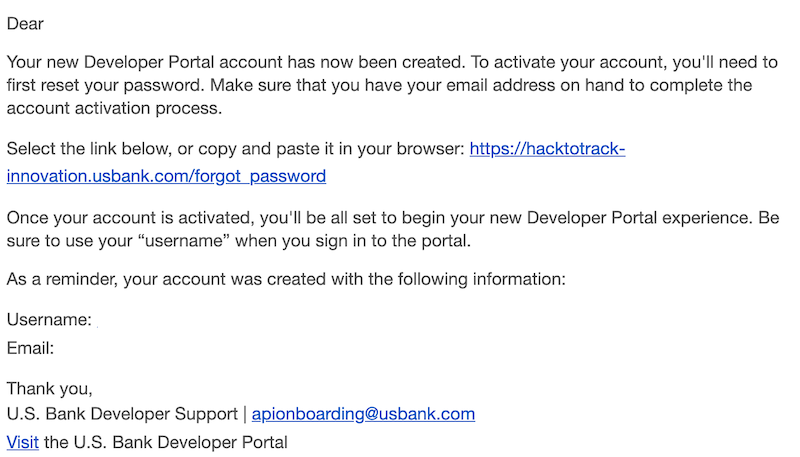

### U.S. Bank Innovation Developer Portal

#### Getting access to the hackathon developer portal
The U.S. Bank Innovation developer portal is located at: [https://hacktotrack-innovation.usbank.com/](https://hacktotrack-innovation.usbank.com/). The site is restricted so you will need to obtain an account before viewing any of the API content.

#### Requesting an account
Self-service registration is quite simple and efficient.

**Step 1:** From the main page, click on the "Get started" button This will open a new window with a complete registration form to create a new account.

>You can also click on the *Login* button in the upper right corner and follow the link to create a new user

**Step 2:** Fill out the form

Fill out all of the required fields including a valid email address (in order to receive the registration confirmation message). You can use your school for *Organization*.

> Note: Your email address will be your username.

Click the checkboxes to accept the U.S Bank *Terms of Use* and *Privacy Policy* and acknowledge the reCAPTCHA.

**Step 3:** Submit the user registration form.

After you submit the registration form, you will be returned to the main page. There will be a green banner indicating that your account has been created.

**Step 4:** Check your email

An email confirmation will be sent to the email address that you provided. This email will provide the final steps for completing your registration.

Click the link in the email to set your password. This will return you to the U.S. Bank Innovation developer portal where you will enter your password.

> This is the same form that is used for resetting a forgotten password.  

**Step 5:** Submit your new password

**Step 6:** Accept the U.S Bank *Terms of Use* and *Privacy Policy* documents. You must scroll down to the bottom of each form to view the *Accept* button.

**Step 7:** Log into the U.S. Bank Innovation developer portal.

Now that your credentials have been set, you can login using the *Login* button in the upper right.

